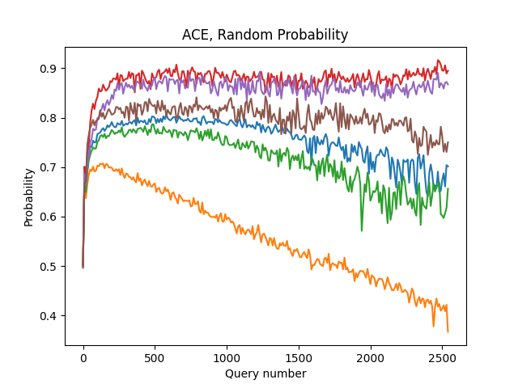
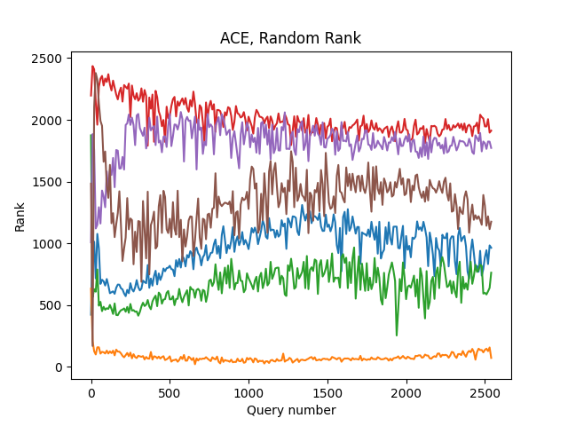
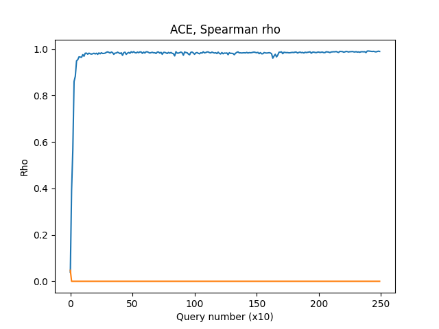

# asreview-ranking-stability

This is a repository containing some code to plot and investigate the rank stability of the predictions coming out of
ASReview.

First create a probability matrix from a .h5 state file. Then use the other functions to create plots. Note that if you
want to customize a bit more, add a title for example, you will have to change the functions a bit.

## Probability plot:

## Rank plot:

## Spearman's rho plot:

# License and Contact
This repository is under an Apache 2.0 license. Contact: @PeterLombaers